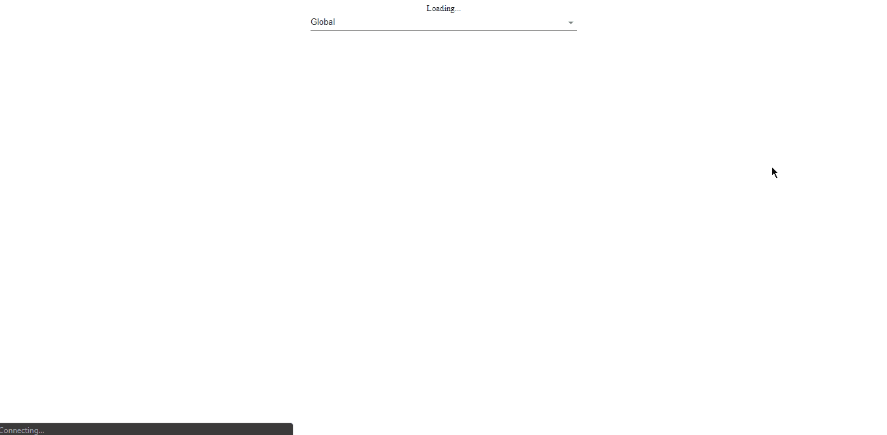
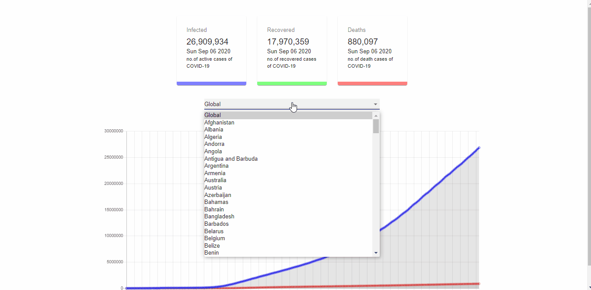

# COVID-19 Tracker

### [Live Site](https://covid19statswebsite.netlify.com/)


## Introduction
I am going to use React, Charts.JS and Material UI to fetch data from an API and display it in a very minimalistic way.

* Displays global data in line chart format.
* Displays individual country data in a bar chart format
<br/>

MORE SCREENSHOTS:

* Line Chart



* Bar Chart:


API used: https://covid19.mathdro.id/api

Setup:
- run ```npm i && npm start```
